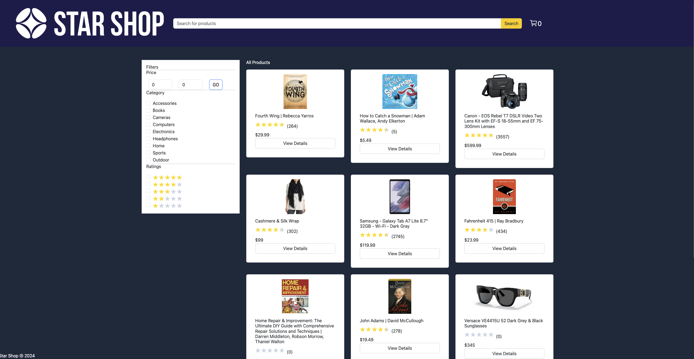
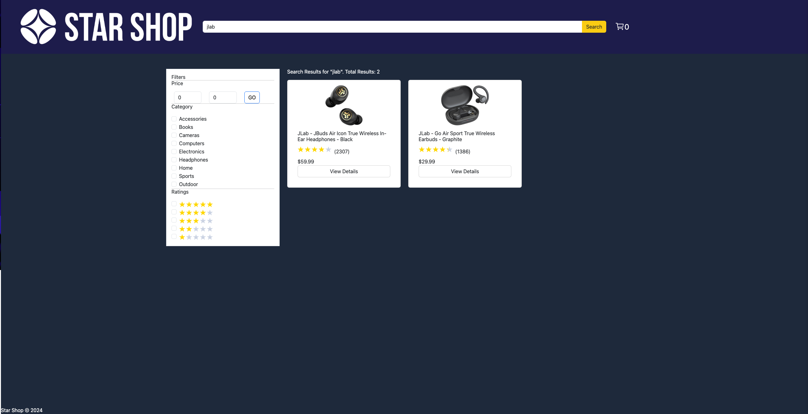
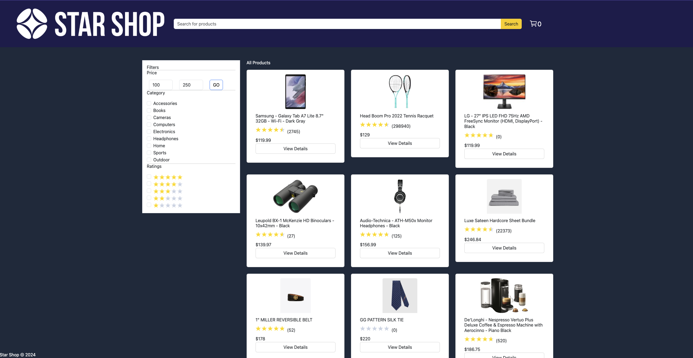
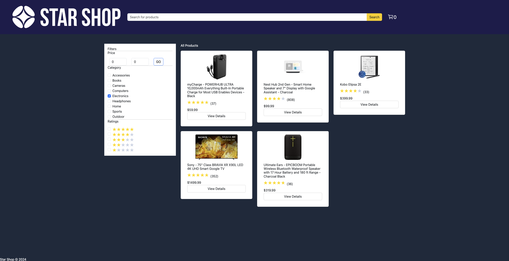
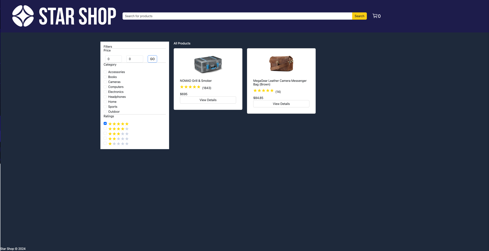
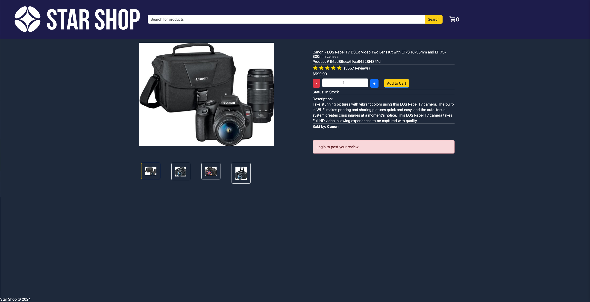
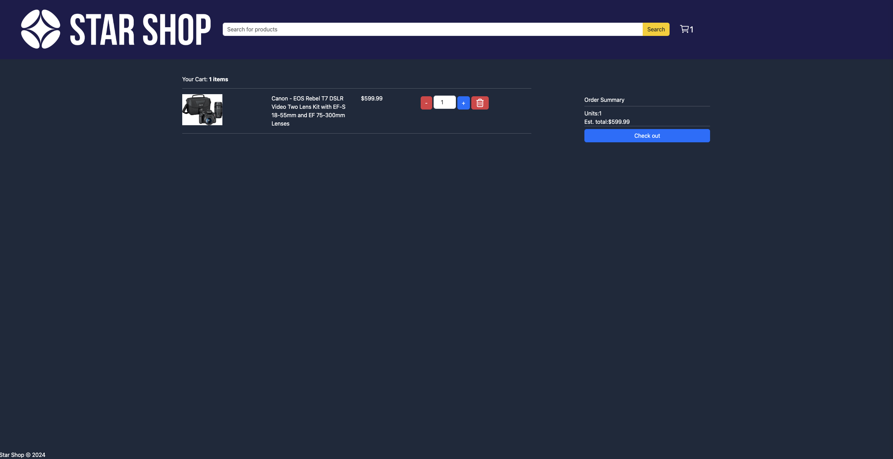
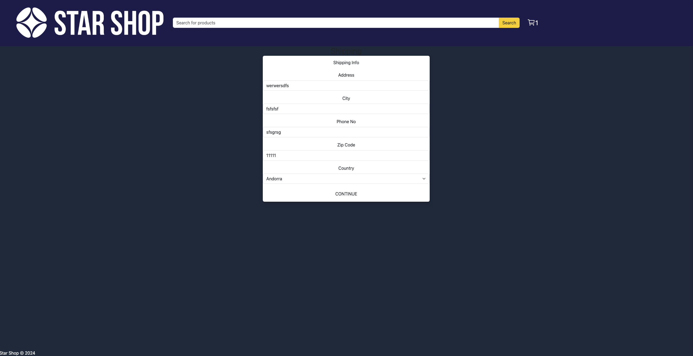
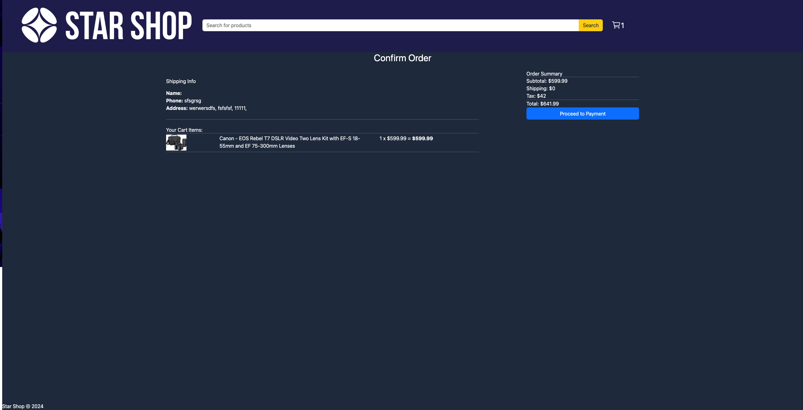
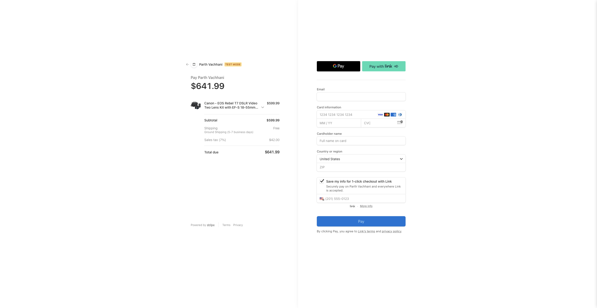

# StarShop
Welcome to StarShop, where you can find and purchase any product under the stars. StarShop is a MERN-stack eCommerce app that allows users to shop for a wide array of products and check their cart out with the implementation of the Stripe API*

<ins>Features:</ins>

- See a full list of a wide array of products
- Filter products by Category, Cost, and Rating
- Search for products
- Add to the cart
- Adjust quantity of specific product in the cart based off available stock or remove item altogether
- Users can input their shipping information and check their cart out

*Stripe Implementation is in test mode so no actual purchases are made on the inputted card information

## Screenshots

Home Screen:

<ins>Search & Filters:</ins>

Search:

Price:

Categories:

Ratings:

Product Details:

Cart:

<ins>Checkout Steps:</ins>

Shipping:

Confirmation:

Payment:

## Technologies Used

Mongoose, Express, React, Node, Bootstrap CSS, Tailwind CSS, Looka (App Icon and Logo), React Redux Toolkit, React Icons, React Hot Toast, React Star Ratings, bcrypt, jsonwebtoken, Stripe

## Getting Started

Make your first purchase on <a href="https://main--starshopcapstone.netlify.app/">StarShop</a>!

Here is the <a href="https://trello.com/b/cGXQc7pk/sei-capstone">Trello Board</a> used for planning this project.

<ins>To run locally on your own machine</ins>

After cloning/forking and cloning, be sure to run an npm install in both the frontend and backend directories to install the necessary dependencies. Create a developer account on Stripe and use your Stripe secret key to handle payments. Connect your own MongoDB database to make sure everything remains stored.

Frontend:

- Point all the js files in the utilities/api subdirectory to http://localhost:4000
- Run the frontend on http://localhost:5173 using npm run dev while in the frontend subdirectory

Backend:

- Change the success_url and backend_url redirects to start with http://localhost:5173
- Run the npm run seed() command to seed the data.js information into the database.
- Ensure the backend server is running on http:localhost:4000 by running the nodemon command while in the backend directory

## Next Steps

- Implement login authentication (Already working in backend, need to implement in front end)
  - This allows for protected routes to be implemented and allow for role specific route access
    - This allows for user specific pages such as profile, order history, and order details to be implemented
    - Once role specific route access is implemented, Admin features that are already working in the backend can be added to the frontend
  - Add Admin feature to look at sales data over time
- Replace manually seeded product data with data from another API (such as Amazon or Shopify)
- Refine CSS to make app more responsive
- Add logic to clear cart after checkout is completed
- Implement more payment options